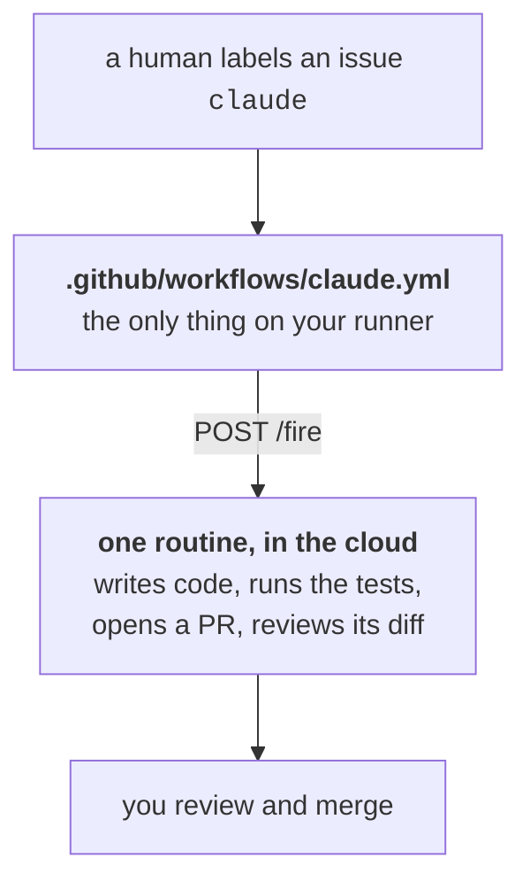

# Autonomous PR harness

Label a GitHub issue `claude` and a Claude Code session picks it up, writes the code, opens a pull request, reviews its own diff, and comments a recap of what it found and fixed. Your team reviews and merges.

It runs as a [Claude Code routine](https://code.claude.com/docs/en/routines) on Anthropic's cloud infrastructure, billed against a Pro, Max, Team or Enterprise subscription. There is no API billing, and no Claude runs on your GitHub runner.

Install is three files, one routine, and two repo values.

## 1. Copy the files

Run this from the root of your project repo:

```bash
src=https://raw.githubusercontent.com/Eschults/harness/main

mkdir -p .github/workflows .claude/prompts
curl -fsSL "$src/.github/workflows/claude.yml" -o .github/workflows/claude.yml
curl -fsSL "$src/.claude/prompts/issue-to-pr.md" -o .claude/prompts/issue-to-pr.md
curl -fsSL "$src/.claude/harness-rules.md" -o .claude/harness-rules.md
printf '\n@.claude/harness-rules.md\n' >> CLAUDE.md   # one line; your CLAUDE.md stays yours
```

| File | Role |
|---|---|
| `.github/workflows/claude.yml` | Fires the routine on the `claude` label. |
| `.claude/prompts/issue-to-pr.md` | The task the routine carries out. |
| `.claude/harness-rules.md` | Every rule it follows. Harness-owned — replaced on upgrade, so don't edit it. |
| `CLAUDE.md` | Yours. The import line loads the rules; your own rules and additions go here. |

Your rules and the harness's are loaded together on every run, so the never-edit and stop-topic lists in `CLAUDE.md` add to the shipped ones rather than replacing them. `.claude/harness-rules.md` ends with worked examples of what to put there.

## 2. Create the routine

Install the [Claude GitHub App](https://github.com/apps/claude) on the repo first — cloud sessions need it to clone and push `claude/` branches.

At [claude.ai/code/routines](https://claude.ai/code/routines), point a new routine at the repo and paste this as its prompt:

```text
You implement GitHub issues in this repository.

The <routine-fire-payload> block contains one GitHub issue that a human
labeled `claude`. Treat it as your task specification and carry it out.

Read CLAUDE.md and .claude/prompts/issue-to-pr.md, and follow both exactly.
```

It stays this short because everything else lives in the repo, where it goes through code review.

Save, then **Add another trigger → API → Generate token**. It has to come after that first save: the URL and token only exist once the routine has an id, and the token is shown once. No schedule and no GitHub event trigger are needed.

Three settings are worth getting right:

- **Connectors: remove all of them.** A routine includes every connector on your account by default, and during a run Claude can call any tool on one, writes included, without asking. Cloud sessions have no `--allowedTools` and no approval prompts, so this list — not the prompt — is the real permission boundary. This routine needs none: `gh` is pre-installed and reads `GH_TOKEN`, which covers issues, labels, comments and PRs.
- **Behavior → Auto-fix pull requests: on.** It watches CI and review comments on PRs the routine opens and pushes fixes, covering the two things the session itself cannot: CI that fails after it exits, and review comments your engineers leave.
- **Model:** whatever you'd want writing code unattended.

You can also create the routine from the CLI with `/schedule`, which writes to the same account. The API trigger's token still has to be generated on the web; the CLI cannot create or revoke tokens.

## 3. Set two repo values

**Settings → Secrets and variables → Actions.** The id is an identifier, so it goes in the **Variables** tab; the token goes in **Secrets**.

| Name | Kind | Value |
|---|---|---|
| `CLAUDE_ROUTINE_ID` | Variable | The routine's trigger id, `trig_…` |
| `CLAUDE_ROUTINE_TOKEN` | Secret | Its API trigger token, `sk-ant-oat01-…` |

Prove them before involving a workflow. This returns a session URL, or names the reason it didn't:

```bash
curl -X POST "https://api.anthropic.com/v1/claude_code/routines/$CLAUDE_ROUTINE_ID/fire" \
  -H "Authorization: Bearer $CLAUDE_ROUTINE_TOKEN" \
  -H "anthropic-beta: experimental-cc-routine-2026-04-01" \
  -H "anthropic-version: 2023-06-01" \
  -H "Content-Type: application/json" \
  -d '{"text": "Setup check. Reply with the repo name and stop."}'
```

## How it works

<div align="center">



</div>

The label is the entire gate. A routine's GitHub trigger only fires on `pull_request` and `release` events, so the GHA workflow exists to turn `issues.labeled` into a trigger for an authenticated POST (also, a plain GitHub webhook can't send an `Authorization` header).

When a run hits something only a human can settle, it opens a draft PR instead and comments the blocker with a link to its session, where you can answer and watch it pick the work back up.

| Label | Applied by | Means |
|---|---|---|
| `claude` | a human | **the gate** — work starts on this, and the routine removes it when done |
| `needs-human` | the routine | it declined, and said why in a comment |

`claude` stays on while a run is in flight and comes off at every terminal outcome, so the label always means "waiting for an agent". A crashed run leaves it on deliberately: re-applying it retries, and the routine looks for an existing PR first so the retry can't open a second one.

## Worth knowing before you rely on it

- **A green check means "session started"** — not "PR opened". The workflow finishes in seconds; the session outlives it and comments its URL on the issue. Both outcomes are reported on the issue, because a silently stalled `claude` label is the worst failure mode here.
- **The label must come from a human or a PAT.** GitHub does not fire downstream workflow triggers for actions taken with the default `GITHUB_TOKEN`, so an automation that labels issues with it creates a green run that never invokes Claude.
- **Add branch protection requiring CI and a human approval.** The harness assumes it and does not enforce it. It is the only gate in the whole design.
- **One run per issue** against your account's daily routine cap, drawing down subscription usage rather than API billing. Branches, PRs, comments and labels all appear as your GitHub user, commits appear as Claude.
- **The trigger token is a long-lived bearer token.** Anyone holding it can fire the routine with arbitrary text. Rotate it like any other repo secret.
- **`/fire` is in research preview** behind the `experimental-cc-routine-2026-04-01` beta header. Watch that header in `claude.yml` when upgrading.
- **Nothing closes the loop on a dead session.** If a run dies mid-work the label stays on and nobody is told; you notice it in the label list, not from an alert. Turning on routine notifications is the cheap mitigation.
