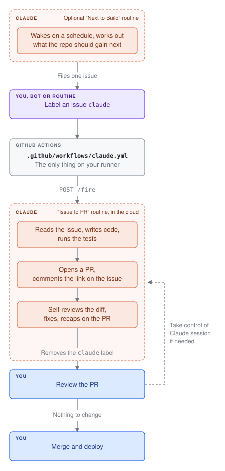

# Autonomous PR harness

Label a GitHub issue `claude` and a Claude Code session picks it up, writes the code, opens a pull request, reviews its own diff, and posts a review recapping what it found and fixed. Your team reviews and merges.

It runs as a [Claude Code routine](https://code.claude.com/docs/en/routines) on Anthropic's cloud infrastructure, billed against a Pro, Max, Team or Enterprise subscription. There is no API billing, and no Claude runs on your GitHub runner.

Install is four files, one routine, one label, and two repo values. The optional step 5 adds a second routine and is what the fourth file is for.

> **Note.** This is a proof of concept and the first brick of a larger design. On its own, labeling an issue is no faster than starting a Claude Code session locally. The label is meant to become a hook for external events (a bug reported by your APM, a roadmap card from your PM tool...) so that engineering work starts without human initiation. Step 5 is the first of those hooks: a scheduled run that decides what to build next and files the issue itself.

## 1. Copy the files

Run this from the root of your project repo:

```bash
src=https://raw.githubusercontent.com/Eschults/harness/main

mkdir -p .github/workflows .claude/prompts
curl -fsSL "$src/.github/workflows/claude.yml" -o .github/workflows/claude.yml
curl -fsSL "$src/.claude/prompts/issue-to-pr.md" -o .claude/prompts/issue-to-pr.md
curl -fsSL "$src/.claude/prompts/next-to-build.md" -o .claude/prompts/next-to-build.md
curl -fsSL "$src/.claude/harness-rules.md" -o .claude/harness-rules.md
printf '\n@.claude/harness-rules.md\n' >> CLAUDE.md   # one line; your CLAUDE.md stays yours
```

| File | Role |
|---|---|
| `.github/workflows/claude.yml` | Fires the routine on the `claude` label. |
| `.claude/prompts/issue-to-pr.md` | The task the routine carries out. |
| `.claude/prompts/next-to-build.md` | The task for the optional proposal routine in step 5. |
| `.claude/harness-rules.md` | Every rule it follows. Harness-owned — replaced on upgrade, so don't edit it. |
| `CLAUDE.md` | Yours. The import line loads the rules; your own rules and additions go here. |

Your rules and the harness's are loaded together on every run, so the never-edit and stop-topic lists in `CLAUDE.md` add to the shipped ones rather than replacing them. `.claude/harness-rules.md` ends with worked examples of what to put there.

## 2. Create the routine

First, go to [Claude GitHub App](https://github.com/apps/claude) and Configure it to have access to your project repo: cloud sessions need it to clone and push `claude/` branches.

Then [create the routine](https://claude.ai/code/routines/new): name it `<repo name> - Issue to PR` (for `acme/webapp`, `Webapp - Issue to PR`), select the project repo, the model, the cloud environment, and paste this as its instructions:

```text
You implement GitHub issues in this repository.

The <routine-fire-payload> block contains one GitHub issue that someone
labeled `claude`. Treat it as your task specification and carry it out.

Read CLAUDE.md and .claude/prompts/issue-to-pr.md, and follow both exactly.
```

It stays this short because everything else lives in the repo, where it is versioned.

Then **Select a trigger → API**, remove any irrelevant **Connectors** available to Claude during runs.

Activate **Behavior → Auto-fix pull requests** to watch CI and review comments on PRs to resume a session and push fixes, covering the two things the session itself cannot: CI that fails after it exits, and review comments your engineers leave.

Last, activate **Notifications** to make sure Engineering gets pinged when a run needs input.

Once created, copy the routine token for the next step.

## 3. Set two repo values

The id is an identifier, `trig_…`; the token is a secret, `sk-ant-oat01-…`. Put both in a `.env` at the repo root, with your editor rather than `echo` so the token never lands in shell history, and make sure `.env` is gitignored:

```dotenv
CLAUDE_ROUTINE_ID=trig_…
CLAUDE_ROUTINE_TOKEN=sk-ant-oat01-…
```

Then load it and push both values to the repo:

```bash
source .env
gh variable set CLAUDE_ROUTINE_ID --body "$CLAUDE_ROUTINE_ID"
gh secret set CLAUDE_ROUTINE_TOKEN --body "$CLAUDE_ROUTINE_TOKEN"
```

Prove them before involving a workflow:

```bash
curl -sS -X POST "https://api.anthropic.com/v1/claude_code/routines/$CLAUDE_ROUTINE_ID/fire" \
  -H "Authorization: Bearer $CLAUDE_ROUTINE_TOKEN" \
  -H "anthropic-beta: experimental-cc-routine-2026-04-01" \
  -H "anthropic-version: 2023-06-01" \
  -H "Content-Type: application/json" \
  -d '{"text": "Setup check. Reply with the repo name and stop."}'; echo
```

If the response looks like :point_down: it worked :tada:

```json
{"claude_code_session_id":"cse_…","claude_code_session_url":"https://claude.ai/code/cse_…","type":"routine_fire"}
```

Anything else is an error naming the reason: bad token, wrong id, or daily routine cap. Note that the session itself does no work, which is expected until the new files are merged.

## 4. Create the label

```bash
gh label create claude --color D97757 --description "starts a Claude Code run" --force
```

`--force` makes this safe to re-run: it creates the label if missing and updates its color/description in place if it already exists, so re-running the install doesn't fail on a label you already have.

## 5. Optional: decide what to build next, on a schedule

So far only a human opens the gate. A second routine closes that loop: it wakes on a schedule, reads the repo, works out the capability it should gain next, and files that as one issue with the `claude` label — which fires the workflow from step 1 and starts an implementation run with nobody in the loop until review.

It needs no workflow and no second token. Routines have their own schedule, so this runs on Anthropic's infrastructure and bills the same way as step 2.

[Create a second routine](https://claude.ai/code/routines/new): name it `<repo name> - Next to build`, select the same repo, model and environment, and paste this as its instructions:

```text
You decide what this repository should gain next.

Nothing triggered this run and there is no issue to read. Work out the
capability the project is missing, and file at most one issue for it.

Read CLAUDE.md and .claude/prompts/next-to-build.md, and follow both exactly.
```

Then **Select a trigger → Schedule** and pick a weekly slot, so the issue is waiting when the week starts. Weekly, not daily: a run that files something costs two against your daily cap, its own and the implementation run the label starts, and a project does not grow a worthwhile new capability every day. Leave **Auto-fix pull requests** off — this routine opens none. Turn **Notifications** on.

It labels the issue as your GitHub user through the Claude GitHub App, so the label does fire `claude.yml`. A GHA cron job labelling with `GITHUB_TOKEN` would not, which is why this is a routine and not a workflow (see "Worth knowing").

## How it works

<p align="center">
  <picture>
    <source media="(prefers-color-scheme: dark)" srcset="docs/how-it-works-dark.svg">
    
  </picture>
  <br/><sub><a href="https://claude.ai/artifact/L4yVFvUXqjVQN1fyGa4hPv">Source</a></sub>
</p>

The label is the entire gate. A routine's GitHub trigger only fires on `pull_request` and `release` events, so the GHA workflow exists to turn `issues.labeled` into a trigger for an authenticated POST `/fire` (plain GitHub webhooks can't send an `Authorization` header).


| Label | Applied by | Means |
|---|---|---|
| `claude` | a human, a bot on their behalf, or the step 5 routine | **the gate**: work starts on this, and the routine removes it when done |

`claude` stays on while a run is in flight and comes off at every terminal outcome, so the label always means "waiting for an agent".

## Worth knowing
- When a run hits something only a human can settle, it opens a draft PR and comments the blocker with a link to its session, where you can answer and watch it pick the work back up.
- The same goes for a finished PR you want changed: **take the session over** in the browser from that link, or **in your terminal with `claude --teleport cse_...`**, and finish the work together rather than starting over.
- **A green check on the GHA run means "session started"** not "PR opened". The workflow finishes in seconds; the session outlives it and comments its URL on the issue. If it cannot start one, it says so on the issue instead, so either way the issue tells you where things stand.
- **The label cannot be added by another GHA workflow.** GitHub does not fire downstream workflow triggers for actions taken with the default `GITHUB_TOKEN`, so a GHA workflow that labels issues with it creates a green run that never invokes Claude.
- **Add branch protection requiring CI and a human approval.** The harness assumes it and does not enforce it. It is the only gate in the whole design.
- **One run per issue** against your account's daily routine cap, drawing down subscription usage rather than API billing. Branches, PRs, comments and labels all appear as your GitHub user, commits appear as Claude.
- **The trigger token is a long-lived bearer token.** Anyone holding it can fire the routine with arbitrary text. Rotate it like any other repo secret.
- **`/fire` is in research preview** behind the `experimental-cc-routine-2026-04-01` beta header. Watch that header in `claude.yml` when upgrading.
- **The step 5 routine is the only thing here that starts work nobody asked for**, and it proposes features rather than fixes, so what it files is a product call. Its prompt tells it to file nothing rather than invent work, but the gate is still branch protection, not the issue. Read what it files before you let a run act on it.

## Upgrading

The four harness-owned files are the only ones an upgrade touches; `CLAUDE.md` is yours and stays as it is. Re-run this from the root of your project repo, then review the diff and commit:

```bash
src=https://raw.githubusercontent.com/Eschults/harness/main

curl -fsSL "$src/.github/workflows/claude.yml" -o .github/workflows/claude.yml
curl -fsSL "$src/.claude/prompts/issue-to-pr.md" -o .claude/prompts/issue-to-pr.md
curl -fsSL "$src/.claude/prompts/next-to-build.md" -o .claude/prompts/next-to-build.md
curl -fsSL "$src/.claude/harness-rules.md" -o .claude/harness-rules.md
```

Run it on a clean tree so the diff is only the upgrade. Local edits to these four files are overwritten rather than merged, check the diff for impacts. The routines' instructions live in claude.ai, not the repo, so check steps 2 and 5 if they changed.
